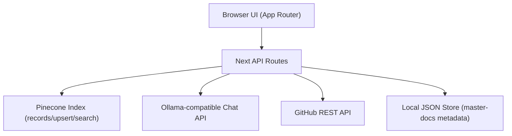

# Emberline (`ragteams`)[link](https://ragbutuseful.vercel.app/)
Emberline is a Next.js16 RAG application for:

- GitHub repository latest-commit inspection and AI diff summaries
- Guideline-based repo review by comparing code-change summaries against uploaded "master docs" PDFs

The UI is built in App Router (`src/app`) and model/data integrations run through server routes in `src/app/api`.

## Core Features

- PDF RAG workflow (`/api/rag`)
- Upload a PDF, chunk and index it in a Pinecone integrated embedding index
- Retrieve top matching chunks for a question
- Generate an answer with an Ollama-compatible chat API
- Fallback to extractive response when model auth fails
- Master docs vault (`/api/master-docs`)
- Upload and store guideline PDFs as reusable review context
- Per-client isolation using `x-ragteams-client-id` namespaces
- Rename, list, and delete master docs
- Automatic TTL cleanup (3 days) for stored guideline docs
- GitHub repo intelligence (`/api/repo-tree`)
- Parse repo input from URL or `owner/repo`
- Build full repository tree from default branch
- Analyze latest commit and highlight changed paths
- Generate concise per-file diff summaries (with fallback)
- Guideline-based diff review (`/api/repo-compare`)
- Compare selected diff summary against retrieved master-doc chunks
- Return structured review text plus cited source snippets

## Tech Stack

- Next.js `16.2.1` (App Router)
- React `19.2.4`
- Tailwind CSS v4
- Pinecone serverless integrated embedding index (REST API)
- Ollama-compatible chat endpoint (`/chat`)
- GitHub REST API (repo tree + commit metadata)
- `pdf-parse` for PDF text extraction

## Project Structure

```text
src/
  app/
    page.js                          # Main workspace UI
    repo/[owner]/[repo]/page.js      # Repo intelligence UI
    api/
      rag/route.js                   # PDF RAG endpoint
      master-docs/route.js           # Master docs CRUD
      repo-tree/route.js             # Repo tree + latest commit summaries
      repo-compare/route.js          # Diff-vs-guideline comparison
  lib/
    rag.js                           # PDF RAG pipeline
    masterDocs.js                    # Master docs ingestion/search/comparison
    repoSummary.js                   # GitHub + diff summarization logic
data/
  master-docs.json                   # Local metadata store (dev/default)
```

## Architecture Overview




Notes:


## Local Development

```bash
npm install
npm run dev
```

App runs at `http://localhost:3000`.

Build and run:

```bash
npm run build
npm run start
```

## API Contracts

### `POST /api/rag`

Multipart form data:

- `pdf`: file (`application/pdf`)
- `question`: string

Response:

- `answer`: generated or extractive fallback text
- `sources`: retrieved chunk list
- `namespace`: Pinecone namespace used for this upload
- `generationMode`: `ollama` or `extractive-fallback`

### `GET /api/master-docs`

Headers:

- `x-ragteams-client-id` (optional, defaults to `anonymous`)

Response:

- `docs`: master doc metadata for that client namespace

### `POST /api/master-docs`

Multipart form data:

- `pdf`: file (`application/pdf`)
- `title`: optional string

Headers:

- `x-ragteams-client-id`

Response:

- `doc`: stored metadata (`id`, `title`, `chunkCount`, timestamps, namespace)

### `PATCH /api/master-docs`

JSON body:

- `docId`: string
- `title`: string

Headers:

- `x-ragteams-client-id`

### `DELETE /api/master-docs`

JSON body:

- `docId`: string

Headers:

- `x-ragteams-client-id`

### `POST /api/repo-tree`

JSON body (either field works):

- `repo`: `owner/repo` or full GitHub URL
- `repoUrl`: `owner/repo` or full GitHub URL

Response includes repo metadata, latest commit details, tree structure, summary policy, and per-file summaries when eligible.

### `POST /api/repo-compare`

JSON body:

- `filePath`: string
- `diffSummary`: string

Headers:

- `x-ragteams-client-id`

Response:

- `comment`: alignment/violations/follow-up review text
- `sources`: matched guideline chunks

## Operational Behavior

- Commit summary generation is skipped when the latest commit changes more than 3 files.
- Commit summary generation is skipped when latest commit diff size is 200 lines or more.
- Master-doc metadata is scoped by `x-ragteams-client-id` and persisted in `master-docs.json`.
- Master-doc vector chunks are stored in Pinecone under per-client namespace hashes.
- Master docs are automatically purged after 3 days (TTL) during read/write flows.
- Ad-hoc RAG uploads (`/api/rag`) use timestamped namespaces and are not explicitly deleted by current code.

## Deployment Notes

- All API routes run on Node runtime (`export const runtime = "nodejs"`).
- Configure all environment variables in your deployment platform.
- For durable metadata persistence in serverless, set `MASTER_DOCS_STORE_DIR` to a persistent writable path.
- Ensure outbound access to Pinecone API/index host, your Ollama-compatible endpoint, and GitHub API.

## Security

- Do not commit `.env.local`.
- Use separate API keys per environment.
- Rotate and scope credentials regularly.

## Suggested Next Improvements

- Add automated tests for API validation/error handling and summary-policy edge cases.
- Add explicit cleanup for temporary `/api/rag` Pinecone namespaces.
- Add structured observability for Pinecone/Ollama latency and failures.
